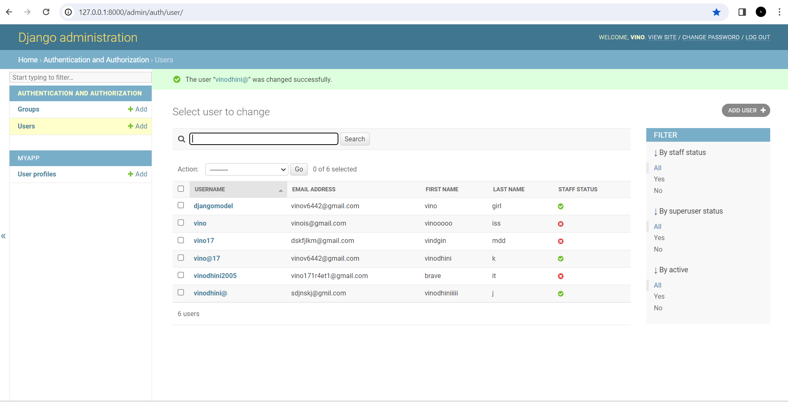

# Ex-04-Django-Models

NAME   : vinodhini . k

REG NO : 23013556

DEPT   : Artificial Intelligence and data science

# AIM

     To create a django model with five users.

     1. Setting  email address for all users.

     2. setting first name and last name for all users.

# Design procedure

# Step1 : Create django project and app

Create django project and app using the following commands:

Django-admin startproject mymodels

Python manage.py startapp myapp

# Step 2: Create a user_profile models in model.py

Add the models in the admin interface using the code in admin.py

# Step 3: Define user creation view

Write the function based view to render the data from the models to the template in view.py

# Step 4: Setup the url 

Setup the url path for the templates using urls.py

In settings.py file add the app created.

# Step 5 Create template

Create a template within your app if it doesn't already exist. Inside this directory, create a template named 'user_profiles.html'.

# Step 6 Apply migrations

Now do the migrations process to initiate and save the models

Python mange.py makemigrations

Python manage.py migrate

# Step 7: Run the program 

Run the program using the command

Python manage.py runserver 8000

In the admin/ page you can view the models created

And  in the user_profile template page you can see the profile page of the user.

# Output

